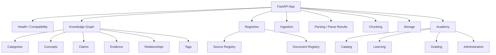
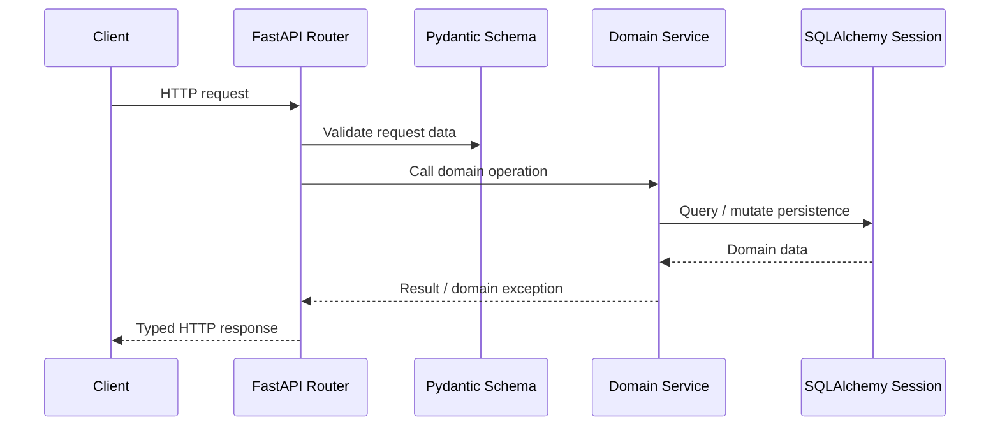

# NEXORA Brain — API Documentation

NEXORA Brain exposes its application capabilities through FastAPI. The API is organized into domain routers rather than a single monolithic route file.

## Running the API

```bash
python -m alembic upgrade head
uvicorn nexora_knowledge.api:app --reload
```

Development OpenAPI interfaces:

- Swagger UI: `http://127.0.0.1:8000/docs`
- ReDoc: `http://127.0.0.1:8000/redoc`
- OpenAPI JSON: `http://127.0.0.1:8000/openapi.json`

## Router architecture



## Major API domains

### Core / compatibility
Includes health and earlier compatibility routes retained by the application.

### Knowledge graph
Domain routers expose categories, concepts, claims, evidence, relationships, sources and tags.

### Source registry
Provides source identity and provenance-oriented operations. Source registry services separate persistent source metadata from individual documents.

### Document registry
Manages document identity and metadata, including import-batch operations.

### Ingestion
Coordinates processing jobs/nodes and the lifecycle required to move registered documents through parser/storage/chunking infrastructure.

### Storage
Exposes storage metadata/control operations while the storage implementation itself remains behind a provider abstraction.

### Parsers and parse results
Parser endpoints expose supported parser operations. Parse-result routes expose persisted parser outputs/history rather than treating parsing as an ephemeral response only.

### Chunks
Chunk-related routers expose chunk sets, chunk metadata and provenance-oriented operations.

### Academy
Separate routers support catalog, learner workflows, grading and administration.

## Request flow



## Error handling

The central application maps domain exceptions into explicit HTTP semantics, including:

- `404` for missing resources;
- `409` for conflicts;
- `422` for domain/parser validation failures;
- `400` for Academy input errors;
- `401` for missing authentication claims;
- `403` for authorization denial.

This keeps domain services from needing to know HTTP response details.

## Authentication / authorization note

The repository contains a provider-neutral `Principal` and authorization policy layer. It expects identity claims to originate from an upstream authentication system in a real deployment. Do not interpret role-policy code as a complete identity provider implementation.

## API discoverability

Because FastAPI generates the authoritative OpenAPI schema from the current code, `/docs` should be used for exact path/request/response definitions. This document intentionally focuses on architecture and domain organization so it does not become stale every time an endpoint evolves.
