# NEXORA Brain — Architecture

NEXORA Brain is a modular document-intelligence and knowledge infrastructure service built with Python, FastAPI, SQLAlchemy, Alembic and Pydantic.

## 1. High-level architecture

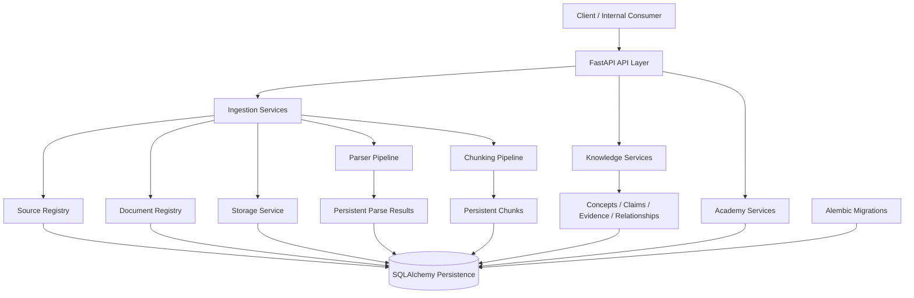

## 2. Layer responsibilities

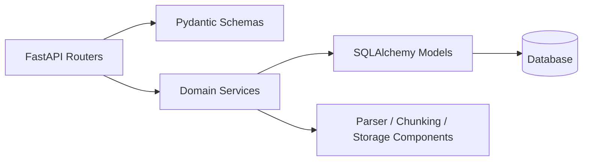

**API routers** handle HTTP concerns. **Schemas** validate contracts. **Services** implement business behavior. **Models** represent persistence. Parser/chunking/storage packages isolate specialized infrastructure.

## 3. Ingestion lifecycle

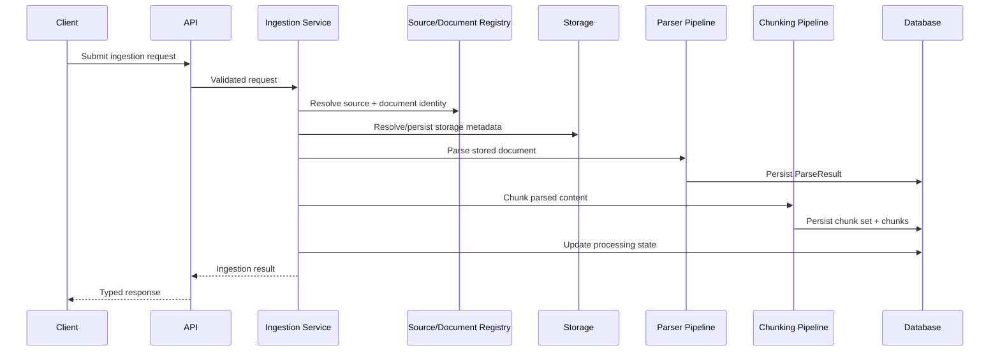

## 4. Parser architecture

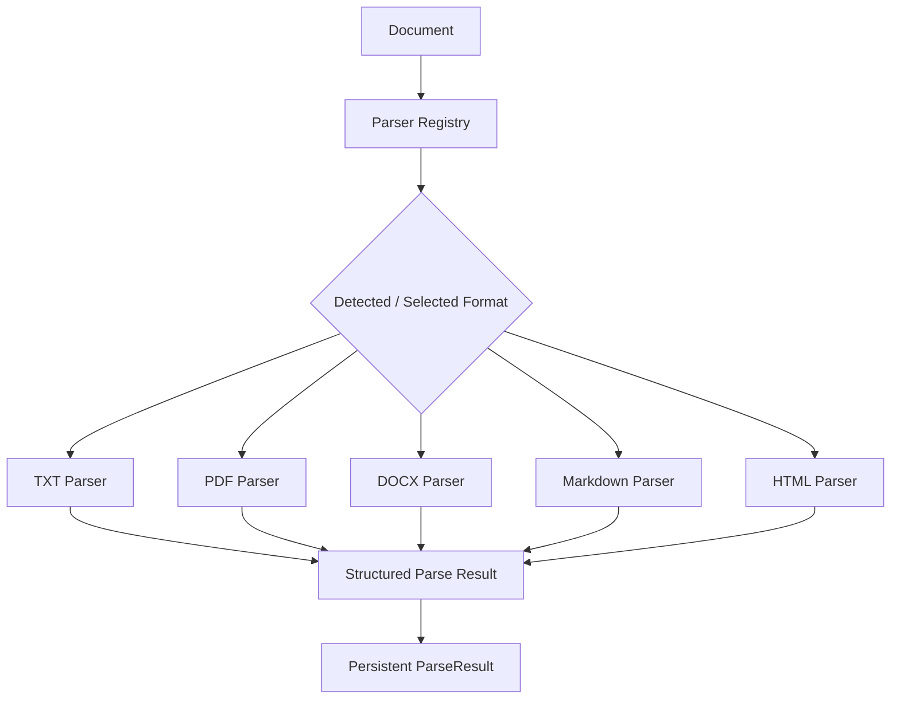

Parser implementations share common abstractions while retaining format-specific logic.

## 5. Deterministic chunking

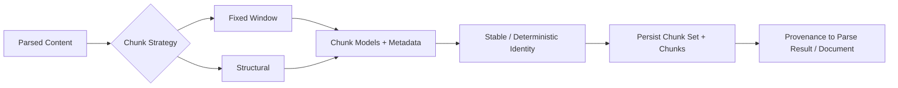

Chunking is modeled as its own subsystem rather than embedded inside parser code, allowing strategies to evolve independently.

## 6. Knowledge model

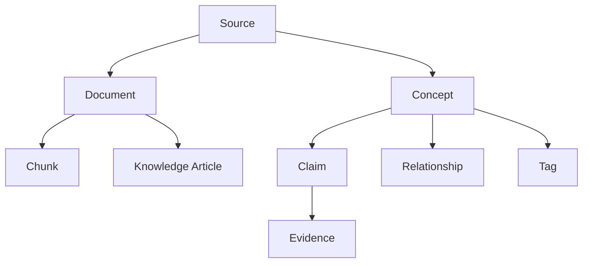

The goal is to retain both document-level provenance and richer semantic structures.

## 7. Persistence and migration architecture

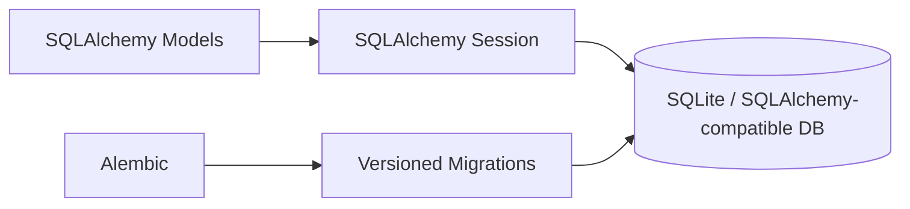

The repository contains multiple migrations representing actual schema evolution. Application startup does not rely on silently recreating the current schema; migrations are applied explicitly.

## 8. Authorization architecture

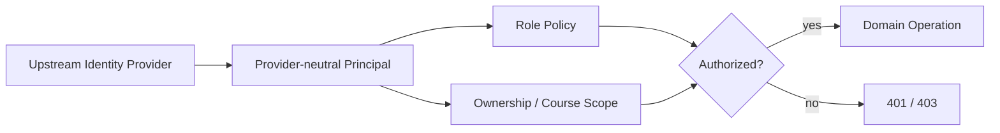

The repository implements authorization policy and principal claims, not a full production authentication provider.

## 9. Academy domain

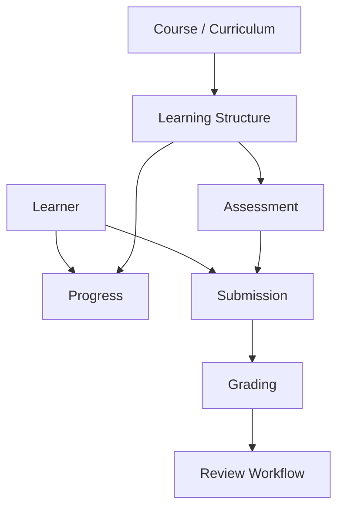

The Academy subsystem demonstrates reuse of the same API/service/model/schema architecture for a larger application domain.

## 10. Testing architecture

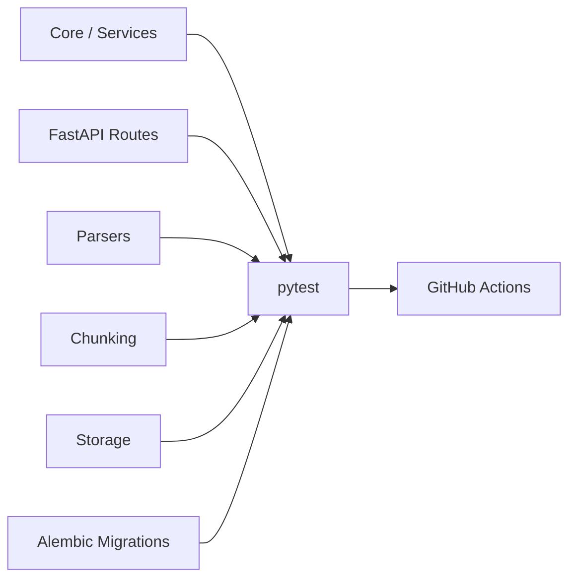

Tests cover both functional behavior and migration/schema compatibility.

## 11. Future AI / retrieval integration

The current repository intentionally stops before claiming a complete RAG system.

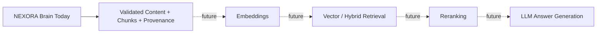

This distinction is important: Brain already provides much of the data infrastructure a retrieval system would require, but embeddings/vector retrieval/LLM generation should only be presented as implemented once those components exist in code.
