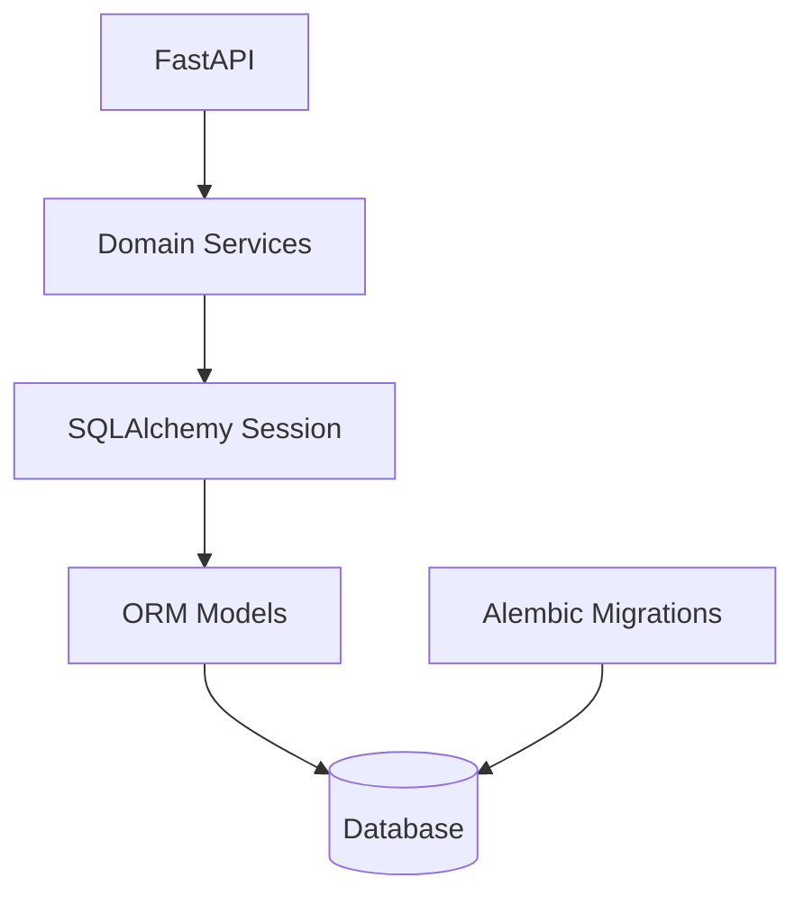
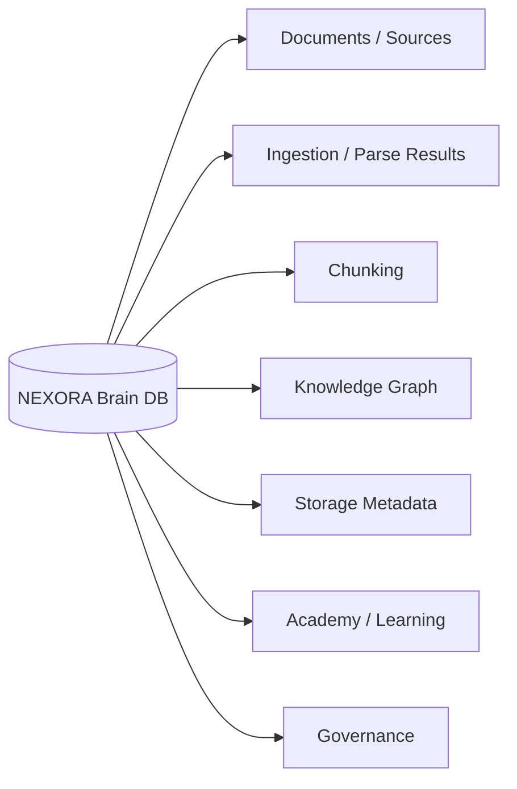
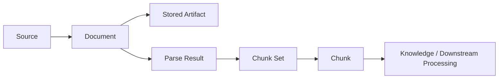
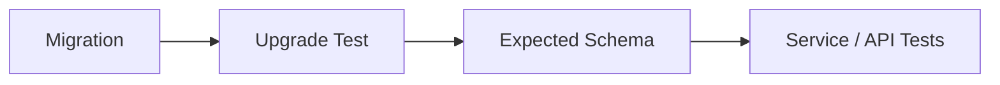

# NEXORA Brain — Database & Schema Architecture

NEXORA Brain uses SQLAlchemy for ORM persistence and Alembic for explicit schema evolution.

## Persistence model



The default development configuration uses SQLite. The database URL is environment-driven through SQLAlchemy, allowing other compatible database backends to be configured separately.

## Major schema domains



### Source and document identity

Models distinguish sources from documents so provenance is not collapsed into a filename. Document records can be associated with source metadata and ingestion/storage state.

### Ingestion and parsing

Persistent ingestion/parse-result models record processing information so parsing can be inspected after the original request completes.

### Chunking

Chunk models preserve chunk sets, individual chunks, ordering/identity and provenance metadata back to parsed/document content.

### Knowledge entities

Structured knowledge models include categories, concepts, claims, evidence, relationships, tags and knowledge articles.

### Academy

Curriculum, learner, progress, assessment/grading and review-oriented models demonstrate a separate application domain on the same persistence architecture.

## Conceptual provenance chain



## Migration history

The current migration sequence includes:

1. `2b_s2_001_initial_schema.py` — initial persistence foundation.
2. `2c_s1_001_add_rich_knowledge_foundation.py` — richer knowledge entities.
3. `2d_s1_001_add_academy_curriculum.py` — curriculum domain.
4. `2d_s2_001_add_learner_engine.py` — learner/progress functionality.
5. `2d_s3_001_add_academy_grading.py` — grading/review functionality.
6. `3a_s1_001_add_source_registry.py` — source registry.
7. `3a_s2_001_add_document_registry.py` — document registry.
8. `3a_s3_001_add_ingestion_orchestration.py` — ingestion orchestration state.
9. `3a_s4_001_add_secure_storage.py` — storage metadata and lifecycle.
10. `3a_s5_001_add_persistent_parser_results.py` — persistent parser outputs.
11. `3a_s6_001_add_deterministic_chunking.py` — deterministic chunking persistence.

## Why migrations matter

The migration history demonstrates how the schema evolved over time. This is different from simply calling `create_all()` against the final ORM model: migrations make changes reviewable, reproducible and deployable across existing databases.

## SQLite compatibility

Alembic configuration supports SQLite migration constraints where batch operations are required. SQLite is convenient for local development/tests, while the SQLAlchemy abstraction keeps the database layer from being hard-wired to raw SQLite queries.

## Testing

The repository contains dedicated migration tests across major schema additions, including curriculum, learning, grading, source/document registries, ingestion, storage, parser results and rich knowledge entities.



## Operational rule

Apply migrations before starting the API:

```bash
python -m alembic upgrade head
uvicorn nexora_knowledge.api:app --reload
```

The application lifecycle deliberately does not treat automatic schema mutation at startup as the migration strategy.
