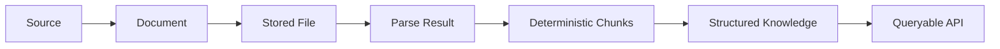
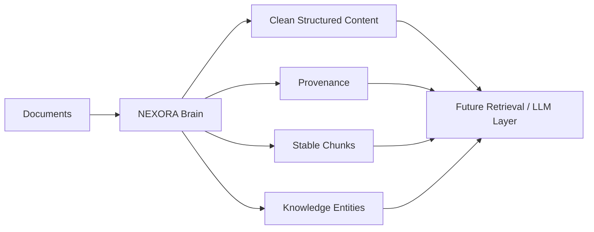

# NEXORA Brain — Project Context

## Executive summary

NEXORA Brain is an independent backend and AI-infrastructure project for transforming heterogeneous documents into persistent, provenance-aware, structured knowledge.

The project focuses on the engineering foundation required before advanced retrieval or LLM systems can reliably operate over private knowledge: source registration, document identity, secure storage metadata, deterministic parsing, persistent parse results, chunking, structured knowledge entities, APIs, authorization policies, database migrations and tests.

## Problem statement

A document-intelligence system must do more than extract text. It needs to preserve the chain from **source → document → parse result → chunk → structured knowledge**, while making processing observable, repeatable and queryable.

## Engineering goals

1. Separate HTTP/API concerns from domain services and persistence.
2. Preserve provenance throughout ingestion and chunking.
3. Make parsing/chunking behavior deterministic where practical.
4. Model schema evolution explicitly with Alembic.
5. Validate API boundaries with Pydantic schemas.
6. Keep storage provider-neutral rather than coupling the domain to one filesystem implementation.
7. Make authorization rules explicit and testable.
8. Maintain broad automated test coverage across application layers.
9. Build a foundation suitable for future retrieval/LLM work without claiming unimplemented RAG capabilities.

## Core domains

### Ingestion
Coordinates source/document registration, processing state, parser execution, persisted results and downstream chunking.

### Document intelligence
Format-specific parsers normalize heterogeneous files into structured parse results with metadata.

### Chunking
Fixed-window and structural strategies convert parsed content into stable chunks suitable for downstream indexing, retrieval or analysis.

### Knowledge representation
The system models categories, concepts, claims, evidence, relationships, tags, sources and knowledge articles.

### Persistence
SQLAlchemy provides ORM persistence while Alembic manages explicit schema evolution.

### Academy / learning domain
The repository also contains an optional educational domain for curricula, learners, progress, assessments, grading and review workflows. This demonstrates that the architecture can support a second substantial domain on top of the same service/persistence patterns.

## Current maturity

The repository contains substantial working application code, database migrations and tests. It should be described as an **engineering/research platform**, not a finished commercial AI product.

Implemented foundation includes FastAPI routing, SQLAlchemy persistence, Alembic migrations, parser infrastructure, source/document registries, ingestion orchestration, storage abstractions, persistent parse results, deterministic chunking, knowledge entities and Academy workflows.

Not yet claimed: production deployment hardening, a vector database, embedding generation, semantic retrieval/reranking, LLM answer generation or a complete production identity provider integration.

## Why it matters for AI systems

Reliable retrieval/LLM systems depend on data quality, provenance and predictable preprocessing. NEXORA Brain concentrates on that foundation first.

## Transferable engineering skills demonstrated

- Python backend development;
- FastAPI / REST architecture;
- SQLAlchemy ORM design;
- Alembic schema migrations;
- Pydantic API contracts;
- document parsing and normalization;
- data ingestion pipelines;
- deterministic text chunking;
- provenance and metadata modeling;
- role/scope authorization policy;
- automated testing with pytest;
- GitHub Actions / repository hygiene;
- architecture documentation and ADRs.

## Ownership and development workflow

AI-assisted coding tools may be used as productivity aids for implementation, debugging, review and documentation. Architecture, integration choices, validation, testing decisions and project ownership remain with the project author.

## Portfolio position

NEXORA Brain complements the NEXORA Trading Engine by demonstrating a different engineering dimension: the Trading Engine focuses on ML-assisted market decision architecture and analytics, while Brain demonstrates backend/data/knowledge infrastructure.
