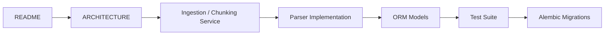

# NEXORA Brain — Project Structure

This document maps the current repository rather than the much smaller early Pack 1 layout.

## Repository map

```text
nexora-brain/
├── .github/
│   ├── workflows/                 # Tests, CI and repository hygiene
│   ├── ISSUE_TEMPLATE/
│   ├── CODEOWNERS
│   └── dependabot.yml
│
├── alembic/
│   ├── env.py
│   └── versions/                  # Versioned schema evolution
│
├── docs/
│   ├── adr/                       # Architecture Decision Records
│   ├── media/                     # Portfolio media planning/assets
│   └── PACK_*                     # Historical sprint implementation notes
│
├── knowledge_sources/
│   └── raw/                       # Small sample ingestion input
│
├── nexora_knowledge/
│   ├── api/                       # FastAPI application + routers
│   ├── chunking/                  # Deterministic chunk strategies/models
│   ├── knowledge_builder/         # Structured knowledge builders
│   ├── models/                    # SQLAlchemy ORM models
│   ├── parsers/                   # TXT/PDF/DOCX/Markdown/HTML parsers
│   ├── schemas/                   # Pydantic contracts
│   ├── seeds/                     # Development/sample seed data
│   ├── services/                  # Domain/business services
│   ├── storage/                   # Storage provider abstractions
│   ├── cli.py
│   ├── config.py
│   ├── database.py
│   └── ingest.py
│
├── tests/                         # API/service/parser/storage/migration tests
├── .env.example
├── pyproject.toml
├── requirements.txt
├── requirements-dev.txt
├── README.md
├── PROJECT_CONTEXT.md
├── ARCHITECTURE.md
├── API_DOCUMENTATION.md
├── DATABASE_SCHEMA.md
└── ... supporting engineering documentation
```

## API layer

`nexora_knowledge/api/` is now a modular router package. The central `__init__.py` creates the FastAPI application, installs exception handlers and registers domain routers.

Notable router areas include Academy administration/catalog/learning/grading, categories, concepts, chunks, claims, document registry, evidence, ingestion, parse results, parsers, relationships, sources/source registry, storage and tags.

## Service layer

`nexora_knowledge/services/` contains the business layer. Recruiters looking for substantial implementation should inspect:

- `ingestion_service.py`
- `chunking_pipeline_service.py`
- `chunking_service.py`
- `document_service.py`
- `parse_result_service.py`
- `parser_pipeline_service.py`
- `storage_service.py`
- `authorization.py`
- `curriculum.py`
- `learning.py`
- `grading.py`

This separation keeps HTTP routing from becoming the business-logic layer.

## Parser framework

`nexora_knowledge/parsers/` contains shared parser infrastructure and format-specific implementations for TXT, PDF, DOCX, Markdown and HTML.

Several parser files are substantial implementations, providing strong evidence of real document-processing work rather than placeholder interfaces.

## Chunking subsystem

`nexora_knowledge/chunking/` includes base abstractions, typed models, a strategy registry, fixed-window chunking, structural chunking and shared helpers. Service-layer orchestration persists chunk results and provenance.

## Persistence models

`nexora_knowledge/models/` contains SQLAlchemy models across multiple domains:

- documents and canonical documents;
- chunks;
- ingestion;
- parse results;
- sources and storage;
- categories/concepts/claims/evidence/relationships;
- knowledge articles;
- governance;
- financial entities;
- curriculum, learning and grading.

## API schemas

`nexora_knowledge/schemas/` mirrors domain boundaries with Pydantic request/response contracts. ORM entities and API contracts are deliberately separate.

## Knowledge builder

`nexora_knowledge/knowledge_builder/` contains builders for categories, concepts, claims, relationships, sources and tags plus extraction/import pipeline utilities.

## Storage

`nexora_knowledge/storage/` defines storage-provider abstractions. The current configuration supports a local provider while keeping the service boundary suitable for future provider implementations.

## Database migrations

`alembic/versions/` demonstrates the evolution from the initial schema through richer knowledge modeling, Academy functionality, registries, ingestion orchestration, secure storage, persistent parser results and deterministic chunking.

This is particularly valuable portfolio evidence because it shows iterative schema design rather than a database created once from the final ORM state.

## Tests

`tests/` contains broad automated coverage across core behavior, APIs, services, schemas, parser behavior, storage and migrations. Important examples include:

- `test_ingestion_orchestration.py`
- `test_document_registry.py`
- `test_source_registry.py`
- `test_persistent_parser_results.py`
- `test_structured_parsers.py`
- `test_chunking_sprint_1g.py`
- `test_secure_storage.py`
- `test_knowledge_graph_api.py`
- `test_learning_services.py`
- `test_academy_grading.py`

## Documentation

`docs/PACK_*` files are historical sprint/implementation records. `docs/adr/` contains Architecture Decision Records. Root-level documentation is the polished portfolio/recruiter surface.

## Recruiter reading path



Recommended files:

1. `README.md`
2. `ARCHITECTURE.md`
3. `nexora_knowledge/services/ingestion_service.py`
4. `nexora_knowledge/services/chunking_pipeline_service.py`
5. `nexora_knowledge/parsers/markdown.py`
6. `nexora_knowledge/models/document.py`
7. `tests/test_ingestion_orchestration.py`
8. `alembic/versions/3a_s6_001_add_deterministic_chunking.py`

## Why the repository is useful as portfolio evidence

Unlike the sanitized NEXORA Trading Engine showcase, Brain can expose considerably more implementation because the core backend/document-processing architecture is itself useful recruiter evidence and does not reveal the private trading strategy. Its strongest signals are code volume, modularity, schema evolution, deterministic processing, testing and documentation.
