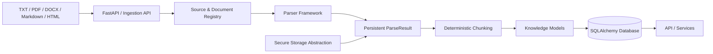
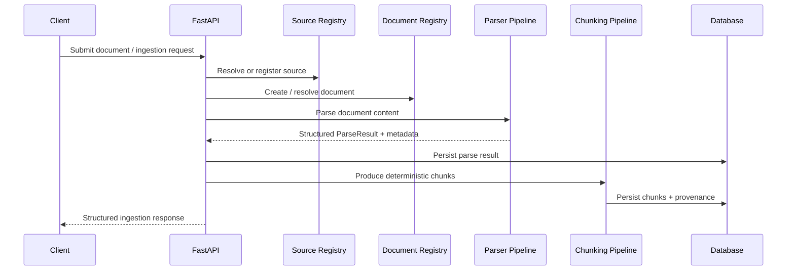
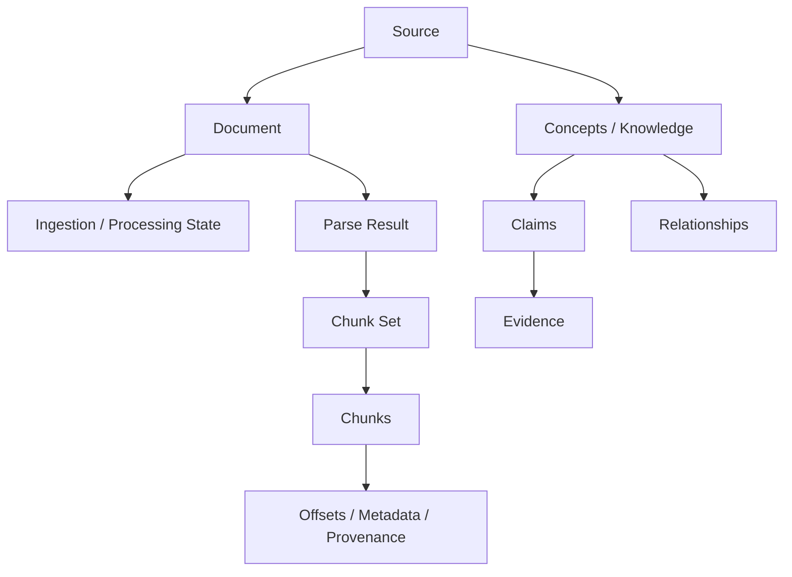
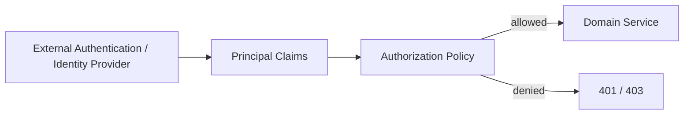
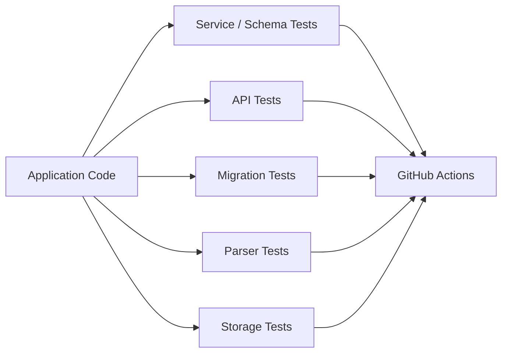

<div align="center">

# NEXORA Brain

### Knowledge Ingestion · Document Intelligence · Knowledge Graph · Deterministic Chunking · FastAPI


**Independent backend / AI infrastructure project by Ashwin Thakoor**

*A modular knowledge-processing platform that ingests heterogeneous documents, preserves provenance, chunks content deterministically, stores structured knowledge and exposes it through a typed FastAPI service.*

</div>

---

## Why this project exists

NEXORA Brain explores the infrastructure required before an application can reliably use documents as machine-readable knowledge.

The core problem is larger than "extract some text from a PDF." A useful knowledge system must answer questions such as:

- Where did this information come from?
- Can the same document be processed deterministically?
- How are sources, documents, parse results and chunks related?
- Can parsed content retain provenance back to its original source?
- How can structured concepts, claims, evidence and relationships be persisted?
- How should ingestion failures, retries and storage be modeled?
- How can these capabilities be exposed cleanly through an API?

NEXORA Brain implements these concerns as separate, testable application layers.

---

## Architecture at a glance



See [`ARCHITECTURE.md`](ARCHITECTURE.md) for deeper ingestion, persistence, API, authorization and data-model diagrams.

---

## Engineering highlights

| Area | What NEXORA Brain demonstrates |
|---|---|
| **Backend architecture** | Layered FastAPI routers, service layer, schemas and persistence models |
| **Document intelligence** | Structured parsers for TXT, PDF, DOCX, Markdown and HTML |
| **Data engineering** | Ingestion orchestration, registries, persistent parse results and provenance |
| **Deterministic processing** | Stable chunking strategies with chunk metadata and reproducible boundaries |
| **Database design** | SQLAlchemy ORM models + multi-stage Alembic migration history |
| **Knowledge modeling** | Categories, concepts, claims, evidence, relationships, sources and knowledge articles |
| **Storage architecture** | Pluggable storage provider abstraction and persisted file metadata |
| **Authorization** | Provider-neutral role/scope policy layer for protected domain operations |
| **Testing** | Broad pytest coverage across APIs, services, schemas, parsers, storage and migrations |
| **Engineering documentation** | ADRs, sprint design notes, API docs, schema docs and architecture documentation |

---

## End-to-end ingestion flow



---

## Main application layers

### API layer — `nexora_knowledge/api/`

FastAPI routers expose domain operations for ingestion, document/source registries, parsers, parse results, chunks, knowledge entities, storage and the optional Academy domain.

The application entry point is:

```bash
uvicorn nexora_knowledge.api:app --reload
```

### Service layer — `nexora_knowledge/services/`

Business rules and persistence operations are separated from HTTP routing. Larger services cover ingestion, documents, chunking, parser execution, storage, curriculum/learning, grading and knowledge entities.

### Models — `nexora_knowledge/models/`

SQLAlchemy models represent the persistent domain. The schema includes source/document registries, ingestion state, parse results, chunks, structured knowledge entities and optional learning/Academy models.

### Schemas — `nexora_knowledge/schemas/`

Pydantic schemas provide validation and API contracts independently from the ORM models.

### Parsers — `nexora_knowledge/parsers/`

The parser framework includes verified implementations for:

`TXT` · `PDF` · `DOCX` · `Markdown` · `HTML`

Parser registry and base abstractions allow document-specific parsing logic to remain modular.

### Chunking — `nexora_knowledge/chunking/`

The chunking subsystem contains typed models, registry infrastructure, fixed-window and structural strategies, helper utilities and persistence-oriented services.

### Knowledge builder — `nexora_knowledge/knowledge_builder/`

Builder components transform extracted material into richer structured entities such as sources, categories, concepts, claims, relationships and tags.

---

## Persistence architecture



Schema evolution is managed through Alembic rather than relying on implicit table creation at application startup.

---

## Database migration history

The repository contains a real multi-stage migration history covering:

- initial schema foundation;
- richer knowledge entities;
- Academy curriculum;
- learner engine;
- grading workflows;
- source registry;
- document registry;
- ingestion orchestration;
- secure-storage metadata;
- persistent parser results;
- deterministic chunking.

This provides recruiters with concrete evidence of schema evolution rather than a single static SQLite prototype.

See [`DATABASE_SCHEMA.md`](DATABASE_SCHEMA.md).

---

## API surface

The FastAPI application registers separate routers rather than placing every route in one monolithic file. Major groups include:

- health / legacy compatibility;
- categories, concepts, claims, evidence, relationships and tags;
- sources and source registry;
- document registry and import batches;
- ingestion and processing nodes;
- storage and stored files;
- parser controls;
- parse results and parse history;
- chunk sets / chunk metadata;
- Academy catalog, learning, grading and administration.

Run the service and use `/docs` for the generated OpenAPI interface. See [`API_DOCUMENTATION.md`](API_DOCUMENTATION.md) for the repository-level map.

---

## Authorization model

NEXORA Brain includes a **provider-neutral authorization policy layer**. Roles such as learner, instructor, reviewer and admin are modeled in application services, with resource-specific role gates and course/ownership scope checks.



Important: this repository models authorization policies, but production authentication still requires integration with a real upstream identity provider or gateway. It should not be described as a complete production authentication system.

---

## Testing depth

The `tests/` directory covers substantially more than a basic smoke test. It includes tests for:

- core functionality;
- parser framework and structured parsers;
- deterministic chunking;
- source/document registries;
- ingestion orchestration;
- persistent parse results;
- secure storage;
- knowledge-graph models/services/API;
- Academy curriculum, learning and grading;
- SQLAlchemy/Alembic migration compatibility.



---

## Quick start

```bash
python -m venv .venv
# Activate .venv for your platform
python -m pip install --upgrade pip
python -m pip install -r requirements-dev.txt

# Copy the safe example configuration
cp .env.example .env

# Apply database migrations
python -m alembic upgrade head

# Run tests
python -m pytest

# Start the API
uvicorn nexora_knowledge.api:app --reload
```

On Windows PowerShell, use `Copy-Item .env.example .env` instead of `cp`.

---

## Configuration

Configuration is environment-driven through `pydantic-settings`. The example configuration covers database location, chunking strategy, ingestion retry limits, file-size/type restrictions and local storage settings.

No real credentials are included in `.env.example`.

See [`CONFIGURATION.md`](CONFIGURATION.md).

---

## Recruiter review — recommended path

1. **README.md** — project purpose and system overview.
2. **ARCHITECTURE.md** — architecture and data-flow design.
3. `nexora_knowledge/services/ingestion_service.py` — substantial service-layer engineering.
4. `nexora_knowledge/services/chunking_pipeline_service.py` — deterministic-processing workflow.
5. `nexora_knowledge/parsers/markdown.py` or `docx.py` — real document-parser implementation.
6. `nexora_knowledge/models/document.py` / `chunk.py` — ORM/data-model depth.
7. `tests/test_ingestion_orchestration.py` and `tests/test_chunking_sprint_1g.py` — verification depth.
8. **DATABASE_SCHEMA.md** — schema evolution and migrations.

---

## What this project does **not** claim

NEXORA Brain is not presented as a finished commercial RAG platform, autonomous AI agent or production SaaS deployment. The repository currently demonstrates the infrastructure **underneath** those kinds of systems: ingestion, parsing, structured storage, provenance, knowledge modeling, APIs and deterministic chunking.

A vector database, embedding/retrieval stack and LLM answer-generation layer can be added later, but they should not be claimed as implemented until they actually exist in the codebase.

---

## Documentation

| Document | Purpose |
|---|---|
| [`PROJECT_CONTEXT.md`](PROJECT_CONTEXT.md) | Product problem, architecture intent and engineering decisions |
| [`ARCHITECTURE.md`](ARCHITECTURE.md) | Detailed diagrams and component relationships |
| [`PROJECT_STRUCTURE.md`](PROJECT_STRUCTURE.md) | Repository map and recruiter reading guide |
| [`API_DOCUMENTATION.md`](API_DOCUMENTATION.md) | API/router organization |
| [`DATABASE_SCHEMA.md`](DATABASE_SCHEMA.md) | Persistence model and migration evolution |
| [`CONFIGURATION.md`](CONFIGURATION.md) | Environment/configuration model |
| [`TESTING.md`](TESTING.md) | Testing strategy and coverage map |
| [`SECURITY.md`](SECURITY.md) | Security assumptions and reporting guidance |
| [`ROADMAP.md`](ROADMAP.md) | Next engineering milestones |

---

## License

**Copyright 2026 NEXORA / Ashwin Thakoor. All Rights Reserved.**

This repository is publicly visible for technical and portfolio review. Public visibility does not grant permission to copy, redistribute or modify its source, documentation or assets. See [`LICENSE`](LICENSE).

<div align="center">

### NEXORA Brain
**Backend Engineering × Document Intelligence × Data Architecture × AI Infrastructure**

</div>
