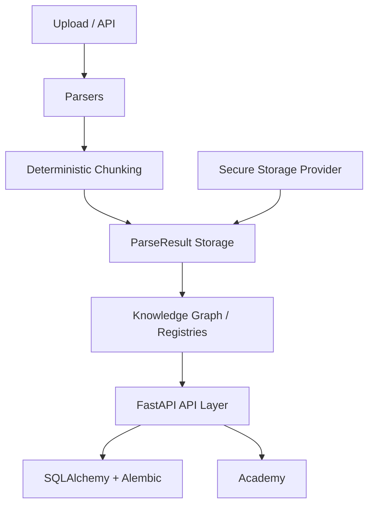

# NEXORA Brain


NEXORA Brain is a knowledge ingestion and knowledge-graph component. This repository contains the brain service, API, database schema and supporting utilities. The README focuses on features implemented and tested in this export rather than unsupported production claims.

## Highlights

- FastAPI-based HTTP API for ingestion, search and knowledge management.
- SQLAlchemy models and Alembic migrations for database schema management.
- Source Registry and Document Registry for provenance and source metadata.
- Secure-storage abstraction for uploaded content and artifacts.
- Deterministic parsing pipelines for TXT, PDF, DOCX, Markdown and HTML.
- Persistent ParseResult storage for parsed documents and extracted metadata.
- Deterministic chunking with provenance metadata for downstream indexing and reasoning.
- Academy primitives for curriculum, learner progress, assessments, grading and reviews.
- Pytest test suite covering core services, migrations and API routes.

## Architecture



## API

The FastAPI application is exposed through `nexora_knowledge.api`, with OpenAPI/Swagger documentation available at `/docs` when running locally.

Representative route groups include:

- `/api/v1/ingest` — ingestion orchestration;
- `/api/v1/documents` — document metadata and ParseResult access;
- `/api/v1/sources` — source registry management;
- `/api/v1/knowledge` — knowledge relationships and queries;
- `/api/v1/academy` — curriculum, progress, assessments and grading.

See `API_DOCUMENTATION.md` for implementation details.

## Parsing, chunking and provenance

Supported input formats in this export are TXT, PDF, DOCX, Markdown and HTML. Parsers produce structured results that are persisted and linked to document/source records. Deterministic chunking allows identical inputs to produce stable chunk boundaries and identifiers while retaining provenance metadata.

## Database and migrations

SQLAlchemy is used for relational persistence and Alembic manages schema migrations. Migration scripts are maintained under `alembic/versions`.

## Testing

Tests use `pytest` under `tests/`. A typical local workflow is:

```bash
python -m pip install -r requirements-dev.txt
python -m alembic upgrade head
python -m pytest
```

## Quick start

```bash
python -m venv .venv
# activate the virtual environment for your platform
python -m pip install -r requirements-dev.txt
# copy .env.example to .env and configure local values
python -m alembic upgrade head
uvicorn nexora_knowledge.api:app --reload
```

## Security

Credentials and secrets should never be committed. Configuration is environment-driven and storage/database access should be restricted appropriately. See `SECURITY.md` and `CONFIGURATION.md`.

## Status

This is a component-focused engineering project and research platform. Deployment-specific hardening such as TLS, external identity, secrets rotation and production storage configuration remains environment-dependent.

## License

**Copyright 2026 NEXORA / Ashwin Thakoor. All Rights Reserved.**

No portion of the source code, documentation or assets may be copied, distributed or modified without prior written permission. See `LICENSE` for the repository terms.

## Documentation

- `API_DOCUMENTATION.md`
- `ARCHITECTURE.md`
- `CONFIGURATION.md`
- `DATABASE_SCHEMA.md`
- `INSTALLATION.md`
- `PROJECT_STRUCTURE.md`
- `SECURITY.md`
- `TESTING.md`

**Author: Ashwin Thakoor**
