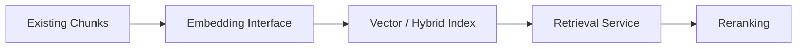
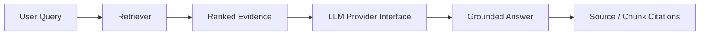

# NEXORA Brain — Roadmap

The roadmap separates **implemented foundation** from future AI/retrieval work so the public repository does not overstate its current capabilities.

## Current foundation

The repository already contains:

- modular FastAPI routers and domain services;
- SQLAlchemy persistence and Alembic migrations;
- source and document registries;
- ingestion orchestration;
- storage abstractions and stored-file metadata;
- TXT, PDF, DOCX, Markdown and HTML parsing;
- persistent parser results;
- deterministic chunking infrastructure;
- structured knowledge entities and builder utilities;
- provider-neutral authorization policies;
- Academy curriculum/learning/grading functionality;
- broad pytest coverage and GitHub Actions CI.

## Phase 1 — Portfolio and reliability hardening

- keep architecture/API/schema documentation synchronized with code;
- remove stale sprint assumptions from recruiter-facing documentation;
- improve static analysis, formatting and test-quality gates;
- strengthen failure-path tests for ingestion/parsing/storage;
- improve structured observability and error diagnostics;
- document deployment/security boundaries clearly.

## Phase 2 — Retrieval foundation

Planned work:

- provider-neutral embedding interface;
- vector or hybrid index integration;
- semantic retrieval service;
- metadata/provenance filters;
- retrieval evaluation datasets;
- precision/recall-oriented evaluation;
- optional reranking layer.

## Phase 3 — Grounded answer generation

Planned work:

- provider-neutral LLM interface;
- context assembly and token budgeting;
- grounded answer generation;
- chunk/source citations;
- refusal/insufficient-evidence behavior;
- evaluation for groundedness and retrieval quality.

## Phase 4 — Production-oriented hardening

Potential future work:

- real authentication provider integration;
- rate limiting and abuse controls;
- cloud/object-storage provider;
- background workers/queues for large ingestion jobs;
- structured metrics/tracing;
- production database deployment;
- malware/content scanning for uploaded files;
- deployment automation and rollback strategy.

## Phase 5 — Advanced knowledge intelligence

Potential research directions include entity extraction, richer knowledge-graph construction, document change detection, version-aware retrieval, graph-assisted retrieval and learning workflows built on top of the Academy domain.

## Non-claim policy

Items in future phases are **roadmap items, not current features**. README/resume descriptions should be updated only after the corresponding capability is implemented and tested.
