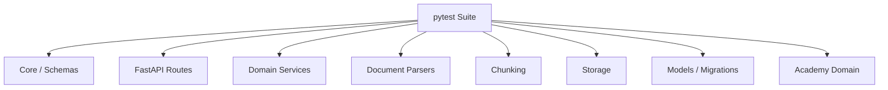
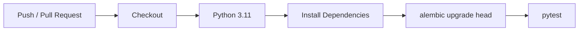

# NEXORA Brain — Testing Strategy

NEXORA Brain uses `pytest` across API, service, persistence, parser, storage and migration layers.

## Run the complete suite

```bash
python -m pytest
```

## Run a focused test file

```bash
python -m pytest tests/test_ingestion_orchestration.py
```

## Coverage map



### Ingestion and registries

Representative tests cover source registry behavior, document registry behavior, ingestion orchestration and persisted parser results.

### Parser framework

Parser tests exercise shared parser behavior and structured format-specific implementations including document formats supported by the parser registry.

### Deterministic chunking

Chunking tests validate chunk strategy behavior, persistence integration and metadata/provenance-oriented functionality.

### Knowledge entities

Knowledge-graph tests cover models, services, schemas and API behavior for structured entities.

### Academy domain

Curriculum, learner, progress, assessment, grading and review workflows have dedicated service/schema/API coverage.

### Database migrations

Migration tests validate multiple stages of schema evolution rather than testing only the final ORM state.

## CI

GitHub Actions installs development dependencies, applies Alembic migrations and executes the pytest suite on pushes and pull requests. A compile check is also present in the Brain test workflow.



## Test environment

Core tests are designed to run without production external services. CI uses temporary SQLite databases, keeping the automated suite reproducible and avoiding committed database artifacts or credentials.

## Portfolio value

The test suite is important evidence for this repository: it shows that the project is not just a collection of architecture documents or API route declarations. The persistence, parser, ingestion and learning subsystems have executable verification alongside their implementation.
