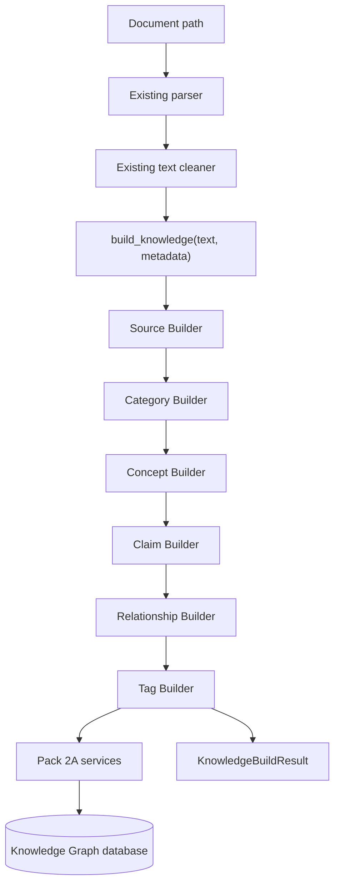

# Pack 2B Sprint 1: Intelligent Knowledge Builder

Pack 2B adds a deterministic, modular pipeline that turns parsed document text
into the Pack 2A Knowledge Graph. It does not change Pack 1 ingestion, search,
the existing CRUD endpoints, or their service contracts.

## Architecture



The importer owns file detection, parsing, and cleaning. The public pipeline
accepts already parsed text, so callers that already have text do not need a
temporary file.

## Pipeline flow

1. `SourceBuilder` normalizes supported metadata, reuses a source by URL or
   source identity, and otherwise creates it.
2. `CategoryBuilder` detects deterministic finance categories. Asset categories
   are children of `Financial Markets`, and unmatched concepts use `General`.
3. `ConceptBuilder` combines a finance dictionary, capitalized phrases, and
   repeated important terms. It normalizes, deduplicates, summarizes, and
   categorizes every candidate.
4. `ClaimBuilder` turns informative sentences into claims, rejects headings and
   short fragments, associates each sentence with its strongest concept match,
   and skips normalized duplicates.
5. `RelationshipBuilder` applies explicit typed graph rules only when both
   endpoint concepts exist. Existing triples are reused rather than inserted.
6. `TagBuilder` infers difficulty, asset-class, risk, psychology, indicator,
   trend, support/resistance, momentum, price-action, technical, and fundamental
   tags and attaches them through the concept service.
7. `KnowledgeBuildResult` returns created entities, counts, warnings, errors,
   duplicate totals, and elapsed processing time.

All inserts and tag associations use the Pack 2A service layer. Builders use
SQLAlchemy only for duplicate lookups; they do not issue raw SQL or bypass
business validation.

## Builder responsibilities

| Module | Responsibility | Replaceable boundary |
|---|---|---|
| `source_builder.py` | Source metadata normalization and reuse | Source resolution strategy |
| `category_builder.py` | Category detection, hierarchy, and fallback | Classifier |
| `concept_builder.py` | Rule-based candidate extraction and summaries | Concept extractor |
| `claim_builder.py` | Sentence filtering, association, and claim type | Claim generator |
| `relationship_builder.py` | Typed deterministic edge rules | Relation extractor |
| `tag_builder.py` | Tag inference and concept association | Tag classifier |
| `extractor.py` | Builder orchestration and result aggregation | Dependency injection point |
| `pipeline.py` | Public API, session lifecycle, timing, report counts | Application boundary |
| `importer.py` | Parser selection, cleaning, metadata defaults, CLI | File boundary |

## Example import

From PowerShell:

```powershell
python -m nexora_knowledge.knowledge_builder.importer `
  knowledge_sources/raw/test_trading.txt `
  --title "Trading Basics" `
  --author "NEXORA" `
  --source-type document `
  --license OWNED
```

From Python with parsed text:

```python
from nexora_knowledge.knowledge_builder import build_knowledge

result = build_knowledge(
    "Forex is part of Financial Markets. Position Sizing controls trade risk.",
    {
        "title": "Trading Basics",
        "author": "NEXORA",
        "source_type": "article",
        "license": "OWNED",
    },
)

print(result.statistics)
print(result.warnings)
print(result.errors)
```

## Future AI integration

Each builder is injected independently by `KnowledgeExtractor`. A later sprint
can replace concept, claim, category, relationship, or tag rules with an LLM,
embedding classifier, or hybrid implementation while preserving the same
builder result contract. The deterministic builders can remain as validation,
fallback, and offline execution paths. Provenance/evidence generation and
confidence calibration can be added as separate builders without changing the
existing CRUD or ingestion APIs.
